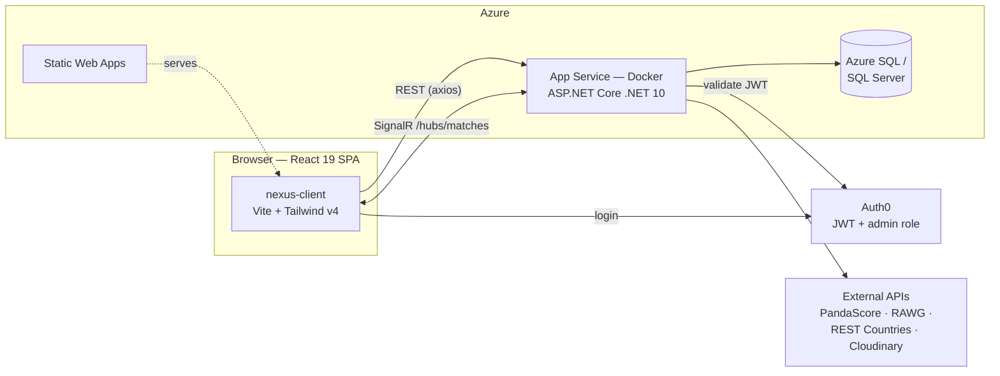

# 🎮 NEXUS — Esports Management Platform


A full-stack esports management platform: browse and manage **teams, players and tournaments**, with **live match results pushed to every connected browser in real time** — no refresh needed.

| | |
|---|---|
| 🌐 **Live app** | <https://lively-water-080879d03.7.azurestaticapps.net> |
| ⚙️ **Live API + Swagger** | <https://nexus-esports-api-ja.azurewebsites.net/swagger> |

---

## Table of contents

- [Features](#features)
- [Architecture](#architecture)
- [Tech stack](#tech-stack)
- [Repository layout](#repository-layout)
- [Using it online](#using-it-online)
- [Running it locally](#running-it-locally)
- [API overview](#api-overview)
- [Real-time updates](#real-time-updates)
- [Authentication & authorization](#authentication--authorization)
- [CI/CD & deployment](#cicd--deployment)
- [Further documentation](#further-documentation)

---

## Features

- **Teams** — rosters, regions, organizations, sponsors, salaries; server-side search, region/game filters, pagination.
- **Players** — profiles with per-match statistics, achievements and interactive performance charts (K/D/A trends, efficiency, radar).
- **Tournaments** — formats (single/double elimination, round robin, …), stages, registered teams and a **live bracket** that funnels rounds toward the final.
- **Live match updates** — when an admin records a winner, a SignalR hub broadcasts it: every visitor sees a site-wide toast, and anyone viewing that tournament sees the bracket update **in place, instantly**.
- **Admin panel** — role-gated create/edit/delete for every resource, image uploads (Cloudinary), and team registration with e-mail confirmation.
- **Realistic demo data** — database seeding that pulls **real esports data** (PandaScore, RAWG, REST Countries) enriched with Bogus-generated stats.
- **Polished UI** — dark/light theming, glassmorphism design system, View Transitions, scroll reveals, full mobile support and reduced-motion accessibility.

## Architecture



The backend is layered — `API → Infrastructure → Domain`, with DTOs in `Contracts`:

- **Controllers stay thin** and never expose domain entities (AutoMapper maps entities ⇄ DTOs).
- **EF Core specifics live in Infrastructure** behind repository interfaces.
- The database schema and the public API can evolve **independently**.

## Tech stack

| Layer | Technology | Used for |
|---|---|---|
| Frontend | React 19 + Vite | SPA with code-split routes |
| | Tailwind CSS v4 | CSS-first design system, dark/light theming via CSS variables |
| | React Router 7 | Routing + View Transitions API |
| | @microsoft/signalr | Live match updates |
| | recharts | Player performance analytics |
| | @auth0/auth0-react | Login + token acquisition |
| Backend | ASP.NET Core (.NET 10) | REST API + SignalR hub |
| | EF Core (code-first) | SQL Server persistence, migrations |
| | AutoMapper | Entity ⇄ DTO mapping |
| | Bogus | Realistic generated seed data |
| Auth | Auth0 | JWT auth, `admin` role claim |
| Integrations | PandaScore, RAWG, REST Countries | Real esports/game/country data for seeding |
| | Cloudinary | Image hosting (logos, photos) |
| | Mailtrap | Registration confirmation e-mails |
| Hosting | Azure Static Web Apps + App Service (Docker) | Automated deploys via GitHub Actions |

## Repository layout

```
nexus-esports/
├── backend/                  # ASP.NET Core solution (backend.slnx) — see backend/README.md
│   ├── Nexus.API/            #   Web API host: controllers, SignalR hub, mapping profiles
│   ├── Nexus.Contracts/      #   DTOs shared between layers (incl. pagination metadata)
│   ├── Nexus.Domain/         #   Entities, enums and domain rules
│   └── Nexus.Infrastructure/ #   EF Core, repositories, seeders, external services
├── frontend/
│   └── nexus-client/         # React SPA — see frontend/nexus-client/README.md
└── .github/workflows/        # CI/CD: backend container deploy + Static Web Apps deploy
```

## Using it online

The deployed app is fully browsable **without an account** — teams, players, tournaments, brackets and charts are all public.

1. Open <https://lively-water-080879d03.7.azurestaticapps.net>.
2. Browse freely; open a tournament to watch its bracket.
3. **Admin actions** (create/edit/delete, recording match winners) require logging in via Auth0 with an account that has the `admin` role. When an admin records a winner, every open browser tab receives the update live.

The API itself is also public for reads — explore it interactively at the [Swagger UI](https://nexus-esports-api-ja.azurewebsites.net/swagger).

## Running it locally

### Prerequisites

- [.NET 10 SDK](https://dotnet.microsoft.com/download)
- SQL Server LocalDB (bundled with Visual Studio) or any SQL Server instance
- [Node.js](https://nodejs.org/) 20+

### 1. Backend

```bash
cd backend
dotnet ef database update --project Nexus.Infrastructure --startup-project Nexus.API
dotnet run --project Nexus.API        # → https://localhost:7059  (Swagger at /swagger)
```

The default connection string in `Nexus.API/appsettings.Development.json` targets SQL Server LocalDB and works out of the box. To fill the database with realistic demo data, call the seed endpoints in order — see [backend/README.md](backend/README.md#database-seeding).

### 2. Frontend

```bash
cd frontend/nexus-client
npm install
npm run dev                           # → http://localhost:5173
```

**Zero configuration needed**: without a `.env` file the app falls back to `https://localhost:7059/api/`, so a locally running backend Just Works. Details (env vars, architecture, conventions): [frontend/nexus-client/README.md](frontend/nexus-client/README.md).

## API overview

All list endpoints support server-side **filtering, searching and pagination** (`pageNumber`, `pageSize`) and return counts in an `x-pagination` response header. **Reads are public; writes require a bearer token with the `admin` role.**

| Resource | Endpoints |
|---|---|
| Teams | `GET/POST /api/teams`, `GET/PUT/DELETE /api/teams/{id}`, `POST/DELETE /api/teams/{teamId}/sponsors/{sponsorId}` |
| Players | `GET/POST /api/players`, `GET/PUT/DELETE /api/players/{id}` (detail includes per-match stats + achievements) |
| Tournaments | `GET/POST /api/tournaments`, `GET/PUT/DELETE /api/tournaments/{id}` (detail includes stages + registered teams) |
| Registrations | `GET/POST /api/tournaments/{id}/registrations`, `DELETE /api/tournaments/{id}/registrations/{teamId}` |
| Stages | `GET /api/tournaments/{id}/stages`, `GET /api/tournaments/{id}/stages/{stageId}` |
| Matches | `GET /api/tournaments/{id}/matches`, `PATCH …/matches/{matchId}` (set winner → SignalR broadcast) |
| Games / Countries | `GET /api/games`, `GET /api/countries`, `GET /api/countries/with-players` |
| Uploads | `POST /api/upload/image?folder=…` (Cloudinary; admin-only) |
| Seed | `POST /api/seed/{resource}` per resource, `DELETE /api/seed/reset` (admin-only) |
| Health | `GET /api/health` |

➡️ **Full reference** — every route, parameter, request body and the SignalR contract: [backend/README.md](backend/README.md).

## Real-time updates

When an admin records a match winner, the API broadcasts through the **SignalR hub** at `/hubs/matches`:

1. **Global group** — every connected client receives `GlobalMatchUpdated` and shows a site-wide toast (*"Team X defeated Team Y"*).
2. **Per-tournament group** — clients viewing that tournament receive `MatchUpdated` and patch the bracket in place: no refetch, no reload.

This is why two people watching the same bracket both see the winner appear the moment it is recorded.

## Authentication & authorization

[Auth0](https://auth0.com) issues JWTs.

- **Reading is public** — anyone can browse teams, players and tournaments.
- **Writing is admin-only** — the API validates the bearer token and enforces an `AdminOnly` policy requiring the `admin` role, injected by Auth0 as a custom claim (`https://nexus-esports.com/roles`).
- The frontend reads the same claim to decide whether to *show* admin UI — but **the API is the actual gate**; hiding a button is UX, not security.

## CI/CD & deployment

Both pipelines run automatically on pushes to `main` that touch their half of the repository:

| Workflow | Trigger paths | What it does |
|---|---|---|
| `backend-deploy.yml` | `backend/**` | Builds the Docker image (`backend/Nexus.API/Dockerfile`), pushes it and deploys to **Azure App Service** |
| `azure-static-web-apps-*.yml` | frontend changes | Builds `frontend/nexus-client` and deploys to **Azure Static Web Apps** (`.env.production` points `VITE_API_URL` at the deployed API) |

## Further documentation

- **[backend/README.md](backend/README.md)** — backend architecture, configuration, migrations, seeding, full API reference, SignalR contract, Docker.
- **[frontend/nexus-client/README.md](frontend/nexus-client/README.md)** — frontend architecture, design system, motion system, conventions.

## 👨‍💻 Author

**Jairo Nacurena Tuy** — [LinkedIn](https://www.linkedin.com/in/jairo-nacurena) · [GitHub](https://github.com/J41r0Ps)
